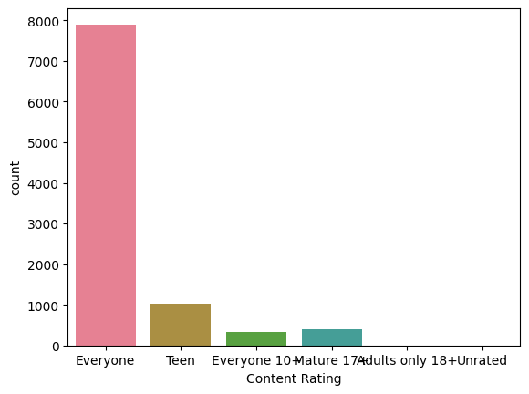
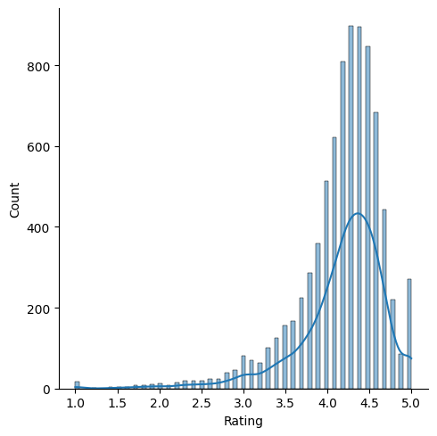
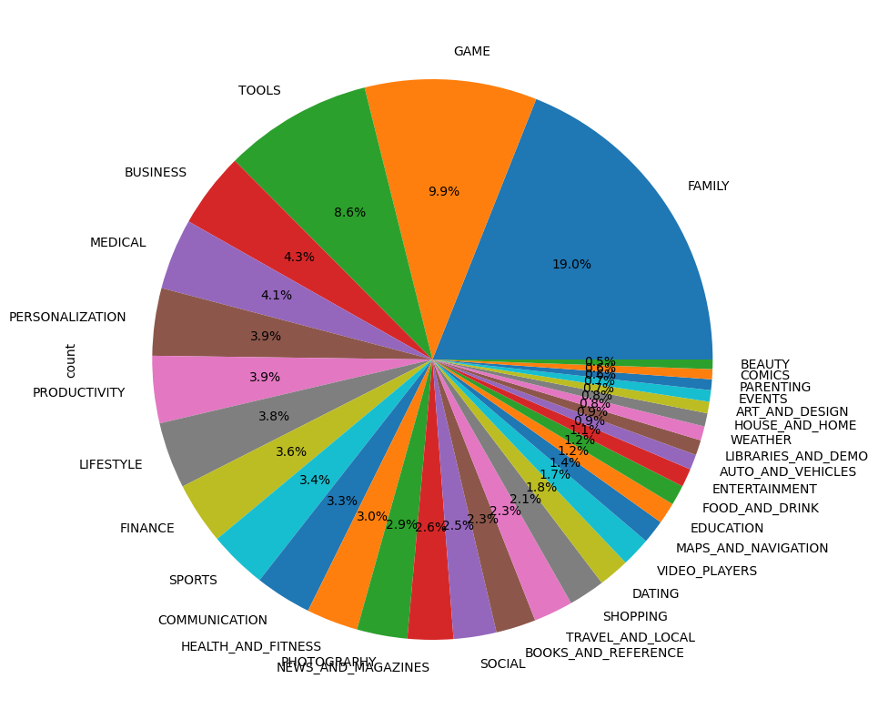

# 📱 EDA on Google Play Store Dataset

This repository contains a detailed Exploratory Data Analysis (EDA) performed on the Google Play Store dataset. The primary objective is to clean the data, extract meaningful insights, and visualize patterns to prepare the data for future machine learning models.

---

## 📌 Dataset

- **Source**: [Google Play Store dataset](https://www.kaggle.com/datasets/lava18/google-play-store-apps)
- **Rows**: ~10,000
- **Columns**: 13 features including App name, Category, Rating, Reviews, Size, Installs, Price, Content Rating, Genres, etc.

---

## 🧽 Data Cleaning and Preparation

Steps taken:
- Removed **duplicates** and **non-numeric entries**
- Converted data types (`Reviews`, `Size`, `Installs`, `Price`, `Last Updated`)
- Cleaned and **standardized units** (e.g. MB to KB in `Size`)
- Converted `Last Updated` to datetime and extracted **day**, **month**, and **year**
- Cleaned categorical columns like `Android Ver` by removing noisy text
- Handled missing values

---

## 📊 Exploratory Data Analysis

### 🔹 Categorical Feature Analysis
- Used `value_counts`, `countplot`, and `pie charts` to analyze:
  - App **Type** (Free vs Paid)
  - **Content Rating** distribution
  - **Android Version** support
  - **Category** popularity

### 🔹 Numerical Feature Analysis
- Used `displot`, `boxplot`, `kdeplot`, and `histograms` for:
  - `Rating` distribution
  - Price and installs variation
  - Relationship between installs and rating

### 🔹 Insights:
- **Most apps** are Free (92%)
- **Top Category**: Family (by number of apps)
- **Top Category by Installs**: Games
- `Rating` mostly lies between **4.0 and 4.5**
- `Price` has many outliers but most apps are free or priced below $10

---

## 📈 Visualizations

- `Seaborn` and `Matplotlib` used for all visualizations.
- Sample charts include:
  - Pie chart of most common app categories
  - Countplots of categorical features like `Type`, `Content Rating`
  - Boxplots comparing `Installs` with `Rating`
  - Distribution plots of `Price` and `Rating`
  - Top 10 categories by number of installs
    | ) ||  |
|:----------------------:|:----------------------:|:----------------------:|
| Caption 1              | Caption 2              | Caption 3              |


---

## 📂 Directory Structure
📦 google-playstore-eda/

├── googleplaystore.csv # Original dataset

├── googleplaystore_EDA.ipynb # Colab/Jupyter Notebook

└── README.md # Project overview


---

## 🧰 Tools & Libraries Used

- **Python 3**
- `Pandas`, `NumPy` – Data manipulation
- `Matplotlib`, `Seaborn` – Data visualization
- `warnings`, `datetime` – General utility

---

## 🚀 How to Run

1. Clone the repository:
   ```bash
   git clone https://github.com/your-username/google-playstore-eda.git
   cd google-playstore-eda
   
## 📌 Future Work
- Handle remaining missing values via imputation

- Normalize and scale numerical features

- Add ML-ready features using feature engineering

- Implement predictive models (e.g., predicting app rating or success)

## 🙌 Acknowledgments
- Dataset sourced from Kaggle

- Inspired by the need to understand app distribution and user trends on the Play Store


